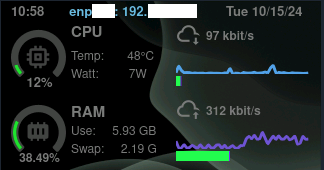

<div id="top"></div>
<br/>
<br/>

<h1 align="center">
    <a href="https://github.com/Piero24/acemagic-S1-panel-conf">ACEMAGIC S1 Mini PC Front Panel Configuration</a>
</h1>

---

This guide provides the installation process I followed to set up the software on the S1, along with the configuration files used for the theme.

## Output Example

Below are examples of the output on the front panel of the ACEMAGIC S1 Mini PC.

<table align="center" cellpadding="10">
    <tr align="center" cellpadding="10">
        <td align="center">
            
        </td>
    </tr>
</table>


## How to install

1. Install Node Version Manager (NVM) as explained [here](https://github.com/nvm-sh/nvm).

2. Install Node.js and npm with the Required Versions (or above):
    
    ```bash
    nvm install 18.13.0
    ```
    Set this version as the default:

    ```bash
    nvm use 18.13.0
    ```

    ```bash
    npm install -g npm@9.2.0
    ```

3. Verify Node.js and npm Versions with sudo. Some commands may need to be run with sudo, so ensure the versions match when running with and without sudo:

    Check Node.js version with and without sudo:

    ```bash
    node -v
    sudo node -v
    ```
    
    Check npm version with and without sudo:

    ```bash
    npm -v
    sudo npm -v
    ```

4. Clone the Repository. Choose a directory where you’d like to clone the project, and run the following command:

    ```bash
    git clone https://github.com/tjaworski/AceMagic-S1-LED-TFT-Linux.git acemagic
    ```
    This will create a folder named `acemagic` with the contents of the project.

5. Install the Project: Navigate to the project folder and run the installation script:

    ```bash
    cd acemagic/s1panel
    sudo ./install
    ```
    Ensure there are no errors during the installation process. The installation should complete with a success message similar to:

6. Verify the Server Status

    After installation, check if the service is running properly by check the status of the s1panel service:

    ```bash
    sudo systemctl status s1panel
    ```
    
    If everything is working fine, you should see an output like this:

> [!IMPORTANT]
> If the service is not running, try following [these](https://github.com/Piero24/acemagic-S1-panel-conf/blob/main/.github/Error.md).
